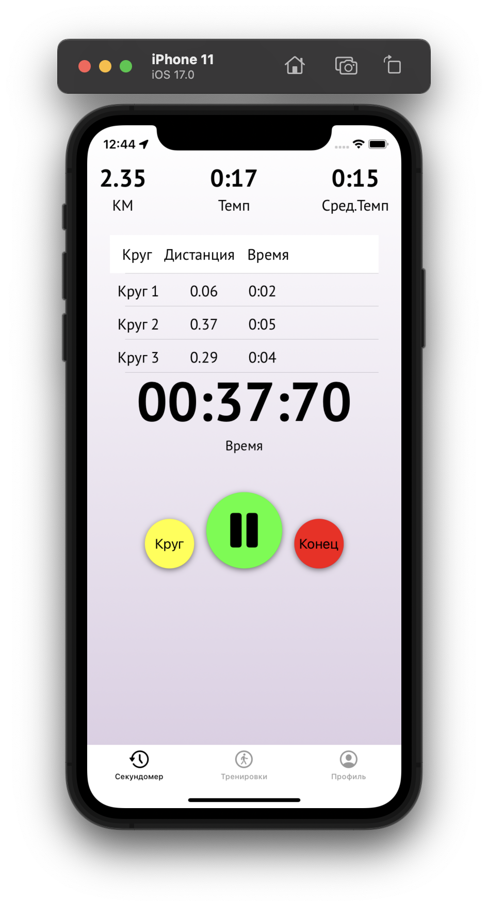
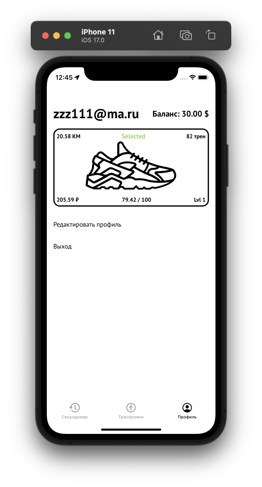
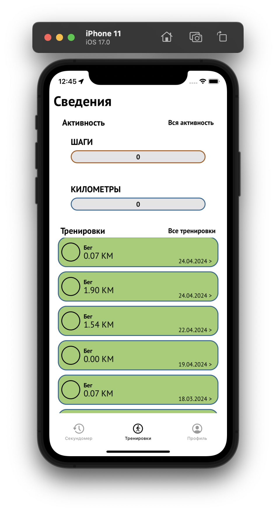
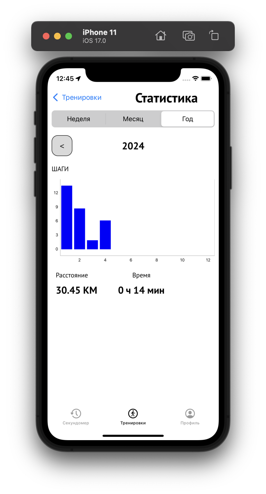
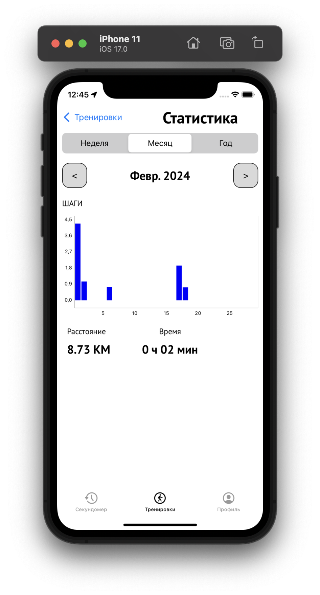

# Run

## Mission
Это приложение используется для занятий бегом. В нем вы можете записывать пройденную дистанцию, анализировать динамику за неделю, месяц или год.

  **Supporting app**
 - [Sergey](https://t.me/Lukichev_s) and [Evgenii](https://t.me/evgenleo)

## Screenshots
<table>
  <tr>
    <th width="50%"></th>
    <th width="50%"></th>
  </tr>
    <tr>
    <th width="50%"></th>
    <th width="50%"></th>
  </tr>
    <tr>
    <th width="50%"></th>
    <th width="50%"></th>
  </tr>
</table>

## Tech stack
- Swift 5
- VIPER
- UIKit
- GCD 
- Async/Await
- SnapKit
- FireBase
- CoreLocation
- DiffableDataSource
- SwipeCellKit
- DGCharts
- SwiftLint
- KingFisher
